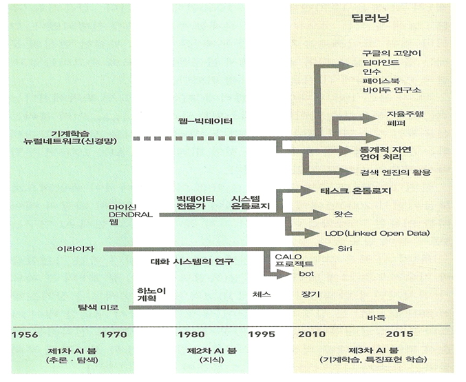
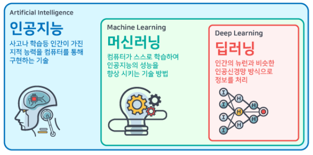
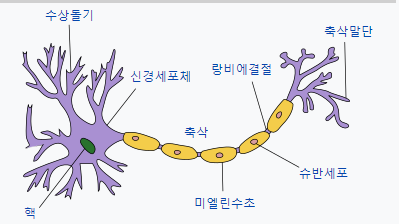
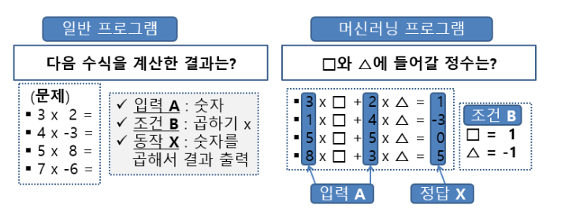
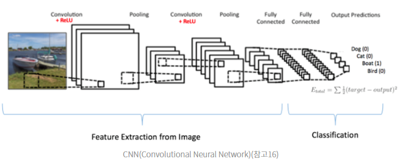
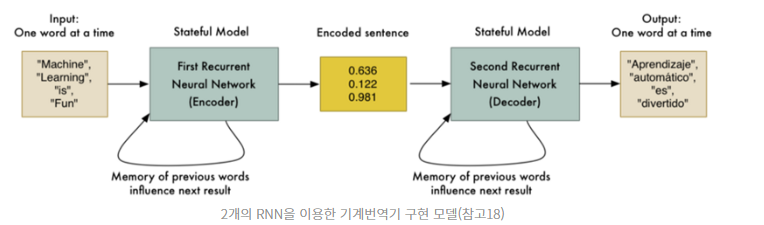

# AI의 역사

## 인공지능이란?
 인간처럼 생각하고 행동하는 관점, 이성적으로 생각하고 행동하는 관점 4개의 관점으로 다양한 정의가 있다.

*   인간처럼 생각하는
*   인간처럼 행동하는
*   이성적으로 생각하는
*   이성적으로 행동하는

   즉,  인간만이 할 수 있다고 생각했던 것들을 컴퓨터가 수행할 수 있도록, 기계가 인간을 흉내내는 것
  
 
  ### 인공지능의 역사
  
*   1940년- 다양한 분야에 걸쳐 인공 두뇌에 관해 논의
*   1956년~1974년(황금기)- 인공지능이라는 연구 분야가 생김
*   1974년~1980년(암흑기)- 컴퓨터성능부족, 많은 데이터량 필요로 효율이 떨어짐
*   1980년~1987년(황금기)- 전문가 시스템 도입으로 다시 한번 부흥
*   1987년~2000년(암흑기)-투자대비 적은 효용성 및 성과부족
*   2000년~오늘날-다양한 성공 사례와 반도체 기술의 발전으로 초창기 인공지능 한계 극복

 
  
  ### 인공지능의 필요성
  
*   인간의 육체 노동 대체
*   인간의 지적 노동 대체하려는 움직임 발생
*   전문 인력 수요 증가

   인공지능이 다양한 분야에서 발전되고 있으며,  인공지능은 가장 넓은 개념이고, 인공지능속에 있는 중요한 구현 방법 중 하나가 기계학습 또는 머신러닝이며, 
   머신러닝 중 하나의 방법으로 딥러닝이 있다.

  이러한 것들을 인공신경망이라고 한다
   
   
   
   ## 인공신경망
   
   ###  "기계가 학습을 한다"

   인공신경망은 사람의 두뇌의 신경세포, 즉 뉴런이 연결된 형태를 모방한 모델이다.
   
   
#### 생물학적 뉴런

*   신경계를 구성하는 기본세포 단위
*   두개이상 모이면 신경이 되어, 신경세포체, 가지돌기, 축색돌기로 구성
*   뉴런은 가지돌기를 통해 다른 뉴런에서 입력신호를 받아서 축색돌기를 통해 다른 뉴런으로 신호를 보낸다
*   가지돌기 - 다른 신경세포에서 보내는 전기화학 신호를 받아들인다
*   축삭돌기 - 전기화학신호를 전달하는 역할

 

 가지돌기로 받아들인 외부의 전달물질을 세포체에 저장하다가, 자신의 용량을 넘어서면 축색돌기를 통해 외부로 전달물질을 내본다
  
#### 인공신경망 뉴런

*   생물학적 뉴런을 수학적으로 모델링한 것
*   생물학적 뉴런이처럼 다른 여러 입력값을 일정 수준이 넘어서면 활성화 되어 출력값을 내보낸다.

     쉽게 생각하며, 생물학적 뉴런도 출력은 하나이고 입력은 다수이다
 
 
    입력 == 가지돌기
 
 
    출력 == 축삭돌기
      
   
  
*   생물학적인 뉴런의 수상돌기 역할을 하는 것이 $x_1, x_2, x_3$와 $\theta_1$, $\theta_2$, $\theta_3$으로  구성된 입력 부분이고, 이러한 입력을 통한 출력값은 h $\theta$이다

*  하여 생물학적인 뉴런의 세포체가 일정한 용량을 넘어서면 외부로 출력값을 보내는 것 처럼,  함수로 예를 들면 일정 값을 넘어서면 1, 그 이하는 0값을 출력한다

##### 인공신경망의 데이터 전달 과정
      
       
      
  
*   데이터 1,2가 입력되었을 때 입력데이터 1이 노란색 선으로 전달돼 노란색 뉴런(h1)으로 표현되었고, 동시에 빨간색 선으로 전달돼 하늘색 뉴런(h2)으로 표현
*   입력 데이터2는 황토색 선으로 이어져 노란색뉴런(h1)이 되고 회색선으로 이어져 하늘색 뉴런(h2)가 된다.
*   뉴런색이 다른다는 것은 입력데이터 1,2를 전달 받았지만 처리한 값이 다르기 때문이다.
*   처음 입력된 데이터들이 계속 다른 값으로 변하면 뉴런에서 뉴런을 거쳐 최종적인 값 (검은색 뉴런)을 만들어 낸다

  
### 머신러닝

*   입력값에 대응하는 결과값이 제대로 나오도록 하는 최적의 매개변수 값을 찾는 과정
*   인간은 학습을 한 뒤에 학습한 내용을 두뇌에 기억하고 이해하거나 익히는 것 처럼 기계는 이해하는 것이 아닌 매개변수 또는 가중치의 형태로 나타나게 된다.
*   컴퓨터가 학습 모형을 기반으로 외부에서 주어진 데이터를 통해 스스로 학습하여 데이터를 분석하고 가공해서 새로운 정보를 얻어 내거나 미래를 예측하는 기술

#### 종류

*   지도학습 - 입력값과 결과값을 같이 주고 학습을 시킴

    ex) 분류,회귀
     
*   비지도학습 - 결과값 없이 입력값만 사용

    ex) 군집화, 압축

*   강화학습 - 결과값 대신 어떤 일을 잘했을 때 보상을 줌

    ex) 행동, 상태
      
        
      

일반적인 컴퓨터는 "A입력에 B조건이 성립하면 X를 동작시키는데 입력숫자와 
곱하기 연산자를 활용하여 결과 값을 계산하지만, 머신러닝은 A라는 정보를 입력할 때 출력 X를 활용하여 스스로 학습하여 조건B를 찾는다
  
 #### 가중치
우리의 뇌가 외부에서 자극이 들어오면 이자극을 전기신호로 변해 무수히 많은 신경세포들을 거친후 뇌가 어떠한 판단을 하게 된다.

이러한 원리로 인공신경망의 데이터 전달과정에서 데이터1의 값은 다른 값으로 전달되려면 입력값에 각기 다르게 곱해진 수치가 필요하다 

#### 활성화 함수

*   출력된 결과값을 전체 층의 출력값 혹은 다음 층의 입력값의 형태로 변환시켜주는 함수
*   오직 선형 함수들의 합성으로 표현했을 때 보다 미선형 함수를 섞으면 정확도가 올라감
*   비선형 함수를 사용하는 이유는 선형함수를 사용할시 자세히 나타나기는 어렵기 때문이다

### 딥러닝

여러 데이터를 이용해 마치 사람처럼 스스로 학습할 수 있게 인공신경망을 기반으로 구축한 기계 학습 기술이며, 인간의 두뇌가 수많은 데이터 속에서 패턴을 발견한 뒤 사물을 구분하는 정보처리 방식을 모방 
#### 종류
  
  #### CNN (Convolutional Neural Network)

*   이미지를 인식하는 데 주로 사용
*   같은 이미지여도 위치와 방향에 따라 변할 수 있기 때문에  Convolution과  Pooling과정을 반복적으로 적용하여 이미지에서 추상화 된 정보를 얻는다

      
       ex) 문장 분류, 물체 감지 및 분활, 이미지 처리

    
    

  #### RNN(Recurrent Neural Network)
*   음성과 글자 등 순차적인 정보를 인식하는데 사용
      
      
    ex) 음성인식, 기계번역, 이미지 설명
    
      
   
