# 회귀의 역사와 정의

## 회귀의 역사
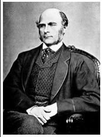

회귀의 원래 의미는 옛날 상태로 돌아가는 것을 의미한다. 영국의 유전학자 프랜시스 골턴은 부모의 키와 아이들의 키 사이의 연관 관계를 연구하면서 부모와 자녀의 키사이에는 선형적인 관계가 있고 키가 커지거나 작아지는 것보다는 전체 키 평균으로 돌아가려는 경향이 있다는 가설을 세웠으며 이를 분석하는 방법을 "회귀분석"이라고 하였다. 이러한 경험적 연구 이후, 칼 피어슨은 아버지와 아들의 키를 조사한 결과를 바탕으로 함수 관계를 도출하여 회귀분석 이론을 수학적으로 정립하였다.

## 회귀란 무엇인가

회귀란 변수가 두 개 주어졌을 때 한 변수에서 다른 변수를 예측하거나 두 변수의 관계를 규명하는 데 사용하는 방법이다.

이때 사용되는 변수 유형은 다음과 같다.

* 독립 변수(예측 변수): 영향을 미칠 것으로 예상되는 변수

* 종속 변수(기준 변수): 영향을 받을 것으로 예상되는 변수

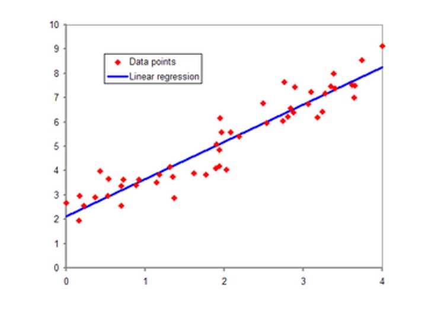

## 회귀분석과 상관 관계의 차이

* 상관 관계는 $x$와 $y$의 두 변수 사이의 연관성 또는 연관성을 알 수있게 해주는 분석으로 설명된다. 반면에 회귀 분석은 독립 변수의 알려진 값을 기반으로 종속 변수의 값을 예측한다.

# 회귀분석의 종류와 특징

## 회귀분석 종류

1) 선형회귀분석

* 단순 선형회귀분석(Simple Linear Regression)
> 설명변수가 1개이며 목표변수와 선형관계

* 다중 선형회귀분석(Multiple Linear Regression)
> 설명변수가 다수이며 목표변수와 선형관계

* 비선형회귀분석(Non-linear Regression)
> 설명변수와 목표변수가 비선형관계 
예시: 2차 함수, 지수 함수 등

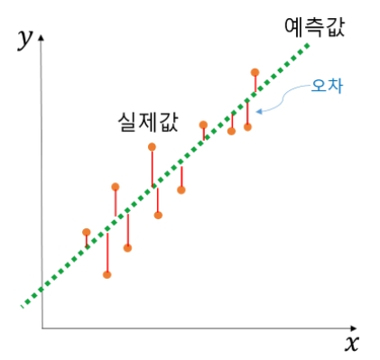

2) 로지스틱 회귀분석

> 로지스틱 회귀분석은 설명변수(독립변수, X)와 범주형 목표변수(종속변수, Y) 간의 관계를 모형화하여 목표변수를 분석하거나 분류하는 통계적 방법론이다.

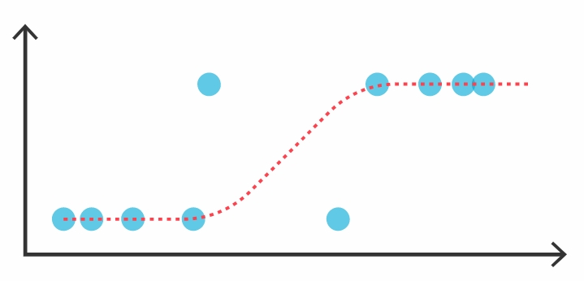

## 회귀분석 특징

<선형 회귀분석 특징>

|구분|내용|
|:------:|------|
|목표변수|연속형|
|분석 목적|예측|
|분석 방법|선형방정식에 의한 함수식 표현|
|모델 탐색방법|최소 자승법, 가중 최소 자승법|
|모델 검정|$F$검정, $t$검정|

* 최소 자승법: 근사적으로 구하려는 해와 실제 해의 오차의 제곱의 합이 최소가 되는 해를 구하는 방법이다.

* F검정:두 모집단의 분산의 차이가 있는가를 검정할 때 사용한다.

* t검정:평균을 비교할 수 있는 통계 가설 검정이다.

<로지스틱 회귀분석 특징>

|구분|내용|
|:------:|------|
|목표변수|이진(binary), 순서(ordinal), 명목(nominal)|
|분석 목적|분류(Classification)/사후확률(Posterior Probability) 예측(i.e.,조건부 확률|
|분석 방법|연결함수(Logit, Probit등)를 이용한 관계 표현|
|모델 탐색방법|최대우도법|
|모델 검정|카이제곱 검정등|

* 최대 우도법: 어떤 확률변수에서 표집한 값들을 토대로 그 확률변수의 모수를 구하는 방법이다. 

* 관찰된 빈도가 기대되는 빈도와 의미있게 다른지의 여부를 검정하기 위해 사용되는 검정방법이다. 

# 회귀분석을 이용하는 이유와 결과로 알 수 있는것

## 회귀 분석을 이용하는 이유

 변수들 간의 구체적인 함수관계를 파악하고자 할 때 즉, 인과관계라던지 한 변수가 다른 변수에 주는 영향력을 알아보고자 할 때 사용한다.

## 회귀분석의 결과로 알 수 있는 것

* 모형적합도: 모형이 데이터에 얼마나 잘 맞는가?

 예) 식사량과 체중의 관계가 데이터에 잘 맞는지 검증해볼 수 있다.

* 회귀계수: 독립변수의 변화가 종속변수를 얼마나 변화시키는가?

 예) 식사량이 증가하면 체중이 얼마나 증가하는지 알 수 있다.

# 회귀분석의 주요 용어와 사용목적

## 회귀분석의 주요 용어

* 회귀 모형 (Regression Model)
     - 변수들 간의 관계를 나타내는 통계적 모형

* 회귀 식 (Regression Equation) : $Y = f() + ε$
     - 변수들 간의 관계를 최적으로 나타내는 확률적 관계식

* 회귀 선 (Regression Line)
     - 변수들간의 확률적 관계식을, 선형(1차)식으로 표현할 때, 기울기를 나타내는 선
    

* 회귀 계수 (Regression Coefficient) = 회귀선의 기울기
     - 반응변수에 미치는 예측변수의 가중치
    
* 결정 계수 (Determination Coefficient)
     - 회귀선의 적합성을 판단하는 척도
        . 상관계수로부터, 구해질 수 있음

## 회귀분석 사용 목적

* 현상을 시도하고 설명

* 미래의 사건 예측
> 회귀 분석에서 사람들이 특정 판촉 후에 더 많은 제품을 구매한 것으로 나타났다면 기업은 어떤 광고를 실행할 지 또는 어떤 판촉을 사용할 지에 대해 정확한 결정을 내릴 수 있다.

* 제조 및 배송 프로세스 최적화
>제과점에서는 쿠키의 유통 기한과 요리할 때 오븐의 온도 사이에 관계가 있을 수 있습니다. 여기서 최적화의 결과는 쿠키의 쫄깃한 품질을 유지하면서 가장 긴 저장 수명이 될 것이다.. 

* 오류 해결

* 새로운 통찰력 제공

* 현상 설명

* 특정 날짜에 판매가 급증하는 이유(변수), 특정 달에 서비스 콜이 증가한 이유, 특정 요일에만 렌트카를 늦게 반납하는 이유(변수)를 찾으려고 할 수 있다.

#  회귀모형의 검정 및 적합도 파악

*  F-statistic 
도출된 회귀식이 회귀분석 모델 전체에 대해 통계적으로 의미가 있는지 파악
 
*  P-Value 
각 변수가 종속변수에 미치는 영향이 유의한지 파악
 
*  수정된 R제곱 
회귀직선에 의하여 설명되는 변동이 총변동 중에서 차지하고 있는 상대적인 비율이 얼마인지 나타냄 
즉, 회귀직선이 종속변수의 몇%를 설명할 수 있는지 확인

# 회귀계수의 추정 두가지 방법

* 최소 제곱법
> 최소 제곱 법은 어떤 계의 해방 정식을 근사적으로 구하는 방법으로, 근사적으로 구하려는 해와 실제 해의 오차의 제곱의 합이 최소가 되는 해를 구하는 방법이다.

* 최대 우도법
> 최대우도법은 어떤 확률변수에서 표집한 값들을 토대로 그 확률변수의 모수를 구하는 방법이다. 어떤 모수가 주어졌을 때, 원하는 값들이 나올 가능도를 최대로 만드는 모수를 선택하는 방법이다.

# 회귀 모델의 종류

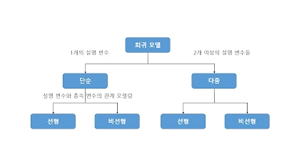
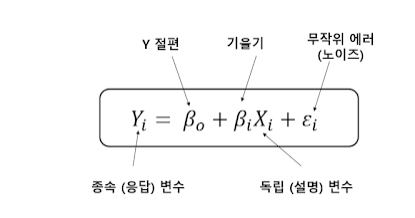

## 회귀 모델의 예측 대상

종속 변수는 설명 변수에 따라서 다양한 값을 가질 수 있다. 와인의 등급을 예측하는 예를 통해 선형 회귀 모델을 만드는 방법을 알아보자.

회귀 모델을 만들기 위해서는 데이터를 측정해야 한다. 와인의 등급을 예측하기 위한 모델을 만들기 위해서는 와인, 와인의 등급, 와인이 만들어진 시기의 강수량, 기온, 토양의 질 등 다양한 정보를 수집해야 한다.

이 때, 우리가 볼 수 있는 모든 와인과 등급을 모집단(참값)이라고 한다. 그리고 그 중 우리가 모을 수 있는 일부의 와인과 등급을 무작위 샘플(관측 값)이라고 한다.

와인의 등급을 결정짓는 실제 규칙이 존재한다고 가정할 때, 우리가 구하고자 하는 모델이 그 실제 규칙을 나타내는 함수라고 할 수 있다. 와인의 등급을 매기는 실제 규칙이 존재하더라도 와인 감별사에 의해 등급이 달라질 수 있는데 이를 규칙에 반영하기 위해 무작위 에러(노이즈)값을 지정한다.

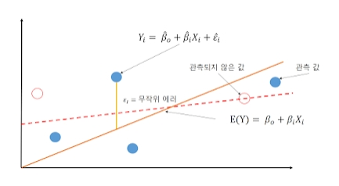

일부 데이터를 가지고 선형 회귀 모델을 추론한다면 항상 정확한 규칙을 맞출 수는 없다. 실제 규칙과는 조금씩 차이가 생긴다. 제대로 된 회귀 모델을 만드려면 차이(error)를 최소화해야 한다.

### 파라미터 예측: 최소 제곱 방법

최소 제곱

* 최적의 모델은 실제 $Y$값과 예측된 $Y$값의 차이 (에러)가 최소가 되어야 함
* 에러의 값은 무조건 양수이어야 하므로 제곱을 시킴
* 최소 제곱 방법은 에러의 제곱의 합(Sum of the Squared Errors, SSE)을 최소화 시킴
* 에러의 제곱의 합을 최소화 시킬 수 있는 파라미터를 찾으면 적절한 회귀 모델을 만든 것임

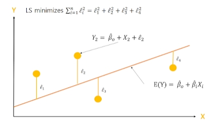
최소제곱의 해

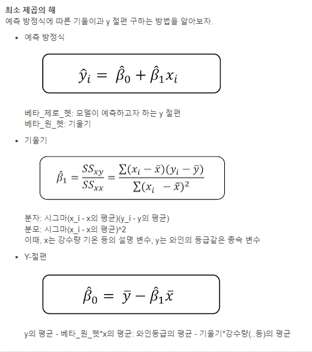
Y절편 구하기

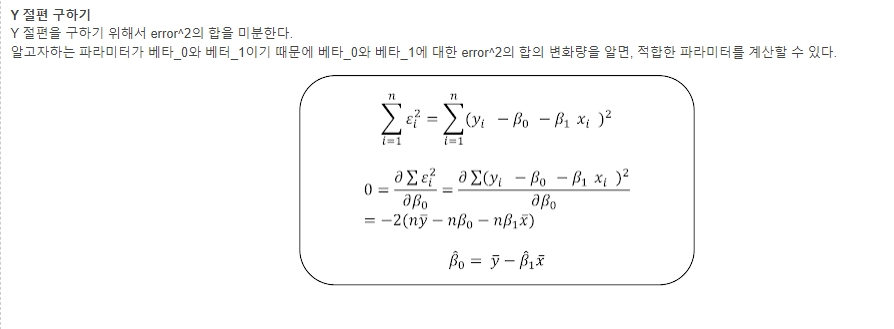
기울기 구하기

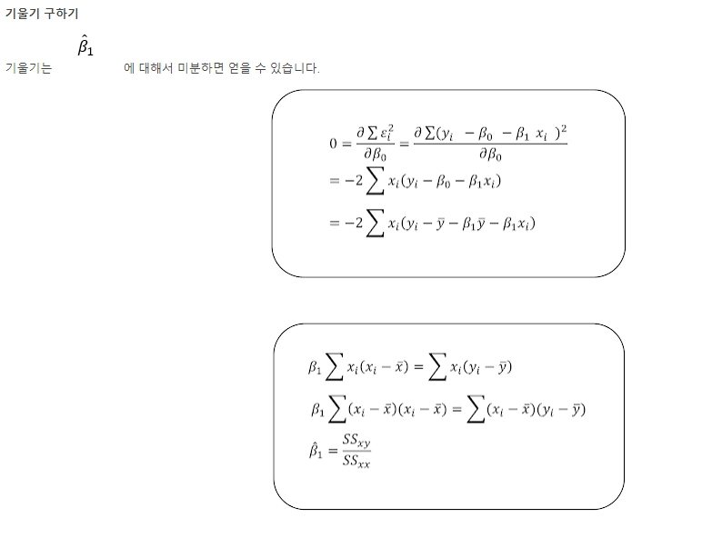
기울기와 y절편의 의미

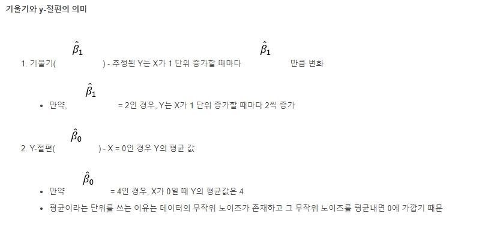
                                                 
# 회귀분석 결정계수 의미와 계산 방법

## 결정계수의 의미

* 종속변수의 분산 중에서 독립변수로 설명되는 비율을 의미한다. 쉽게 말해, 이 통계 모델로 대상을 얼마나 잘 설명할 수 있는가를 숫자로 나타낸 것이 결정계수이다.

## 결정계수($R^2$) 계산 방법

$R^2 = \frac{SSE}{SST} = 1 - \frac{SSR}{SST}$

$SST=\displaystyle\sum_{i=1}^{n}(y_i-\bar{y})^2$

$SST$는 관측값에서 관측값의 평균(혹은 추정치의 평균)을 뺀 결과의 총합이다.

$SSE$ (Explained Sum of Squares)

$SSE = \displaystyle\sum_{i=1}^n(\hat{y_i}-\bar{y})^2$

$SSR$ (Residual Sum od Squares)

$SSR = \displaystyle\sum_{i=1}^n(y_i-\hat{y_i})^2$

$SSR$은 관측값에서 추정값을 뺀 값, 즉 잔차($Residual$)의 총합이다.

# 회귀분석의 가정과 가정의 한계 극복방법

## 회귀분석의 가정 (데이터 관련)

* 오차항은 평균0이고 분산이 일정한 정규 분포를 갖는다.

* 독립변수와 종속변수는 선형 관계이다.

* 오차항은 자기 상관성이 없다.

* 데이터에 아웃라이어가 없다.

* 독립변수와 오차항은 서로 독립이다.

* 독립변수 간에서는 서로 선형적으로 독립이다.

## 회귀분석 가정의 한계 극복 방법

* 독립 변수와 종속 변수가 선형 관계가 아닌 경우: Polynomial regression, Generalized Additive Model(GAM)

* 오차항의 확률분포가 정규 분포가 아닌 경우:Generalized Linear Model(GLM)

* 오차항에 자기 상관성이 있는 경우: Auto-regression

* 데이터에 아웃라이어가 있는 경우:Robust regression, Quantile regression

* 독립 변수 간에 상관성이 있는 경우(다중공선성):Ridege regression, Lasso regression,Elastic Net regression, Principal Component Regression(PCR),Partial Least Square(PlS)regression

# 회귀 분석과정과 문제점

## 회귀 분석 과정

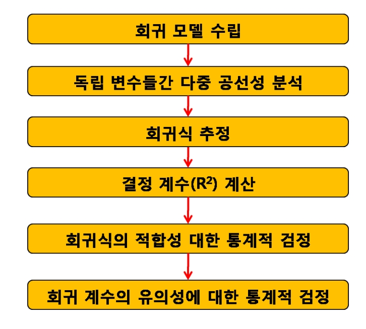

## 회귀 분석의 한계

* 두 변수 사이의 관계를 표시할 수 있지만 변수 중 하나가 다른 변수의 원인으로 된다는 것을 증명하지는 않는다. 

* 독립 변수는 제어할 수 없을 수도 있습니다. 예를 들어 비가 오면 판매량이 증가한다는 것을 알지만 날씨를 제어할 수는 없다.

#참고문헌

[출처1](https://newsight.tistory.com/259)
[출처2](https://dodonam.tistory.com/251) 
file:///C:/Users/HKIT/Downloads/%EB%A1%9C%EC%A7%80%EC%8A%A4%ED%8B%B1%ED%9A%8C%EA%B7%80.pdf 
[출처3](https://thebook.io/080246/part04/ch15/unit31/03-05/)
[출처4](https://m.blog.naver.com/PostView.nhn?blogId=istech7&logNo=50152984368&targetKeyword=&targetRecommendationCode=1)
[출처5](https://math100.tistory.com/116)
[출처6](https://bioinformaticsandme.tistory.com/70)
[출처7](https://m.blog.naver.com/PostView.naver?isHttpsRedirect=true&blogId=fox4361&logNo=220249919846)
[출처8](https://hsm-edu.tistory.com/1222)
[출처9](https://dlearner.tistory.com/41)
[출처10](https://muzukphysics.tistory.com/entry/%ED%86%B5%EA%B3%84-%EB%B6%84%EC%84%9D-7-%ED%9A%8C%EA%B7%80%EB%AA%A8%EB%8D%B8-%EC%A0%81%ED%95%A9%EB%8F%84-%ED%8F%89%EA%B0%80-%EB%B0%A9%EB%B2%95-with-R-%EC%9E%94%EC%B0%A8-%EA%B2%B0%EC%A0%95%EA%B3%84%EC%88%98-F-T)
[출처11](https://www.tibco.com/ko/reference-center/what-is-logistic-regression/)
[출처12](https://walkingwithus.tistory.com/606)
[출처13](https://www.thinkzon.com/share_report/1085441)
[출처14](http://mcheleplant.blogspot.com/2019/01/lab-2.html)
